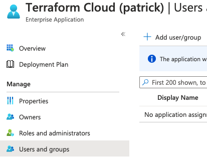

# tfc_sso_azure

Based on this documentation
https://www.terraform.io/cloud-docs/users-teams-organizations/single-sign-on/azure-ad

 
# How to

## Azure Portal
- login to Azure portal   
https://azure.microsoft.com/en-us/features/azure-portal/
- Go to Azure Active Directory service.
- Go to Enterprise Applications    
  
- select New application.  
- Select Terraform Cloud    

- Give it a name and select create. This can take a minute  
  
- Go to Single sing-on and click  
  
- Select the SAML option  
  
- Copy the `App Federation Metadata Url` which we will need later    
  
- Leave this page open

## Terraform Cloud

- Login to Terraform Cloud
- Go to settings -> SSO --> Setup your SSO provider    
  
- Select Azure    
  
- Paste the `App Federation Metadata Url` from Azure  
  
- Save settings
- You should see the SSO details in Terraform Cloud
- Copy the Entity ID and Reply URL    
  

## Azure Portal

- Edit the Basic SAML Configuration    
  
- Paste the Entity ID and Reply URL from Terraform Cloud
- The Single Sign on URL paste
```
https://app.terraform.io/session
```
- Download the `Certificate (Base64)` which we will need in Terraform Cloud  
  
- Go to Manage -> Users and groups
- Click on Add user/group  
  
- select the user you want to add and click assign  
  


## Terraform Cloud
- Edit your SSO settings  
  
- Paste the contents of the Public Certificate you downloaded from Azure here  

- Save settings
- Click on test  
  
- Now you can Enable your SSO configuration  
  

